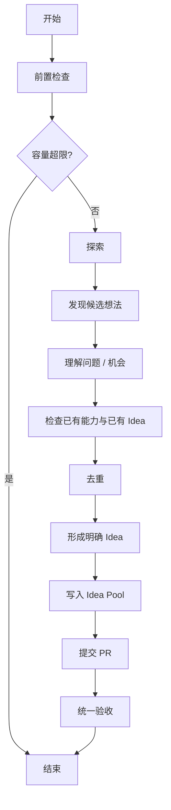

# Idea Generation SOP

> **文档定位**：本文件是 Idea Generator 在本仓库执行「自动发现并写入 Idea」的唯一流程依据。对本文件的任何修订必须走 PR 人审，与代码共用同一迭代环。

## 0. 流程参数（统一声明，调整只改这里）

| 参数 | 默认值 | 说明 |
| --- | --- | --- |
| 单次探索产出 Idea 上限 | 10 | 单次探索生成的候选 Idea 数量上限 |
| 分支格式 | `feat/idea-generation-<YYYYMMDDHHmmss>-<agent-name>` | `<YYYYMMDDHHmmss>` 为本次开始时间，使用 `Asia/Shanghai`；`<agent-name>` 为当前 Agent 的稳定小写标识，仅允许小写字母、数字和连字符 |

分支命名参数要求：

- 本次开始时生成一次北京时间（`Asia/Shanghai`）运行时间戳，格式为 `YYYYMMDDHHmmss`，本次后续所有步骤复用该值，不得重新生成。

## 1. 硬性约束（红线，优先级高于本文件其余任何条款）

1. 只在新建分支上工作，**绝不 push `main`**。
2. 只创建 PR，**绝不 merge、绝不 close / review 他人 PR**。
3. 每次探索最多产出 **1 个 PR**，本次全部新增 Idea 汇总于其中。
4. 禁止一切破坏性 git 操作：force push、`reset --hard`、`branch -D`、`clean -f` 等。

## 概述

本文档定义了 Tool-Craft 自主迭代体系中 Idea 生成的标准流程。

### 目的

建立一个独立的 Idea 生成机制，使 Tool-Craft 可以：
1. 定期探索项目当前状态、已有能力和潜在需求
2. 发现值得实现的新 Idea
3. 对发现的 Idea 进行基本整理和去重
4. 将有效 Idea 放入统一的 Idea Pool
5. 由后续独立的 Development SOP 从 Idea Pool 中获取并实现

### 整体关系

```text
┌──────────────────────┐
│   Idea Generation    │
│        SOP           │
└──────────┬───────────┘
           │
           │ 产生 / 整理
           ▼
┌──────────────────────┐
│      Idea Pool       │
│                      │
│      Pending         │
│      Claimed         │
│      In Progress     │
│      Completed       │
│      Rejected        │
└──────────┬───────────┘
           │
           │ 获取 Idea
           ▼
┌──────────────────────┐
│ Development SOP      │
│                      │
│ 评估 → 实现 → 验证    │
│ → 变更日志 → PR       │
└──────────────────────┘
```

## 流程



### 前置检查

**本次开始时逐项确认一次，全部通过才继续**：

1. 工作区检查：`git status` 确认工作区干净；存在未提交改动 → 视为环境异常，放弃本次运行，**不得 stash / discard / 覆盖任何既有改动**。
2. 容量检查：读取 `.autonomous/idea-pool/idea-pool.md`，统计当前 `Pending` 状态 Idea 数量，确认未超过配置的 `MAX_PENDING_IDEAS` 上限。如果已达到上限，本次结束，等待有 Idea 被领取后再运行。
3. 分支创建：执行 `git fetch origin` 后，依据 §0「分支格式」从最新 `origin/main` 创建并切换到本次运行分支。
4. 分支确认：`git branch --show-current` 复核当前分支为新分支后，才允许修改任何文件。

### 1. 探索

Idea Generator 可以从以下方向探索：

* 当前 Tool-Craft 已有能力
* 当前 Web Tools
* Capability 体系
* API / MCP 能力
* 已有工具之间的能力缺口
* 常见用户需求
* 工具使用过程中的体验问题
* 可以通过本地计算解决的问题
* 外部工具或产品提供的有价值能力
* 项目自身的发展方向

探索的目标是：**找到值得 Tool-Craft 考虑的新增能力或改进机会**。

> 不要为了产生数量而机械制造 Idea。

### 2. 候选 Idea

发现一个可能值得做的方向后，需要先判断：

* 是否能够明确描述？
* 是否确实解决某个问题？
* 是否与 Tool-Craft 的定位相关？
* 是否已经存在相同或高度相似的能力？
* 是否已经存在相同或高度相似的 Idea？

如果只是模糊想法，不要立即写入 Idea Pool。

### 3. 去重

写入 Idea Pool 前必须检查：

1. Tool-Craft 当前已经实现的能力。
2. Idea Pool 中已有的 Idea。
3. 已经 `Completed` 的历史 Idea。
4. 已经 `Rejected` 的历史 Idea。

如果发现已有相同或高度相似 Idea：
> 不创建重复 Idea。

如果一个已经 `Rejected` 的 Idea 因为新的条件发生变化而重新值得考虑：
> 创建一个新的 Idea，而不是修改历史 `Rejected` Idea。

### 4. Idea 的粒度

一个 Idea 应当能够独立成为一个研发任务。

例如：
```text
JSON 格式化
图片尺寸调整
Base64 编解码
时间戳转换
颜色格式转换
```

而不要写成：
```text
把 Tool-Craft 做得更好
增加更多工具
优化用户体验
```

Idea 应回答：**具体想增加什么能力或解决什么问题？**

形成 Idea 时，请遵循 [Idea Pool README](../../../.autonomous/idea-pool/README.md) 中定义的格式规范和状态规则。

### 5. 提交 PR

- **分支**：依据 §0「分支格式」创建，本次全部新增 Idea 共用同一分支，汇总为**一个 PR**。
- **Commit**：遵循 Conventional Commits；使用 `chore: add new ideas to idea pool` 作为 commit 信息。commit 包含 AI 生成内容时，必须按 AI 归属规范在 footer 追加 trailer（人类始终是 author）：

  ```
  Co-authored-by: <Agent 名> <Agent 邮箱>
  ```

  规范全文：<https://github.com/Happyileaf/ai-toolkit/blob/main/docs/agents/ai-attribution.md>（Trae 使用 `trae-agent@users.noreply.github.com`）

- **PR 标题**：`chore: add <N> new ideas to idea pool`
- **PR 描述**：列出新增的 Idea 名称，确认所有 Idea 都已检查去重且符合格式规范。
- **创建动作**：新增 Idea 写入完成后，push 分支并通过 `gh pr create` 创建 PR，目标分支 `main`；本次只创建这一个 PR。

### 6. 统一验收（最终复核，不可跳过）

在提交 PR 之后，对整个过程的产出**重新做一次**完整验收——不沿用此前各环节的结论，逐项重查：

1. **完整性**：对照探索产生的候选 Idea，确认所有通过去重的 Idea 都已正确写入 `idea-pool.md`，格式符合规范。
2. **工作区状态**：`git status` 确认没有未提交的改动。
3. **PR 真实创建**：执行 `gh pr view <分支名> --json url,number`（或 `gh pr list --head <分支名>`）确认 PR 真实存在，取得形如 `https://github.com/<owner>/<repo>/pull/<编号>` 的链接，验收完成。

- 以下链接**一律不算** PR 创建成功：`/compare/...` 对比链接、带 `?expand=1` 的新建引导链接、分支页链接、任何未经 `gh` 命令验证、由 Agent 自行拼接的 URL。
- 任一验收项不通过 → 在**同一分支**直接修复，使用新的 commit 提交修复内容，push 到远端后重新执行**全部**验收，最多 3 轮。无需 amend、rebase、squash 或其他任何历史改写操作；不得修改或删除已经推送的历史 commit。仍不通过 → 本次结束，**不得谎报成功**。
- 全部通过 → 本次**结束**。

## 并发与协作规则

当前 Idea Pool 存储在 Git 仓库中，Idea 可以由 Idea Generator 自动生成，也可以由开发者手动添加。任何人都可以添加 Idea 到 Idea Pool。

自动生成 Idea 写入前：
1. 读取最新的 `.autonomous/idea-pool/idea-pool.md`。
2. 检查是否存在重复 Idea。
3. 检查是否已经有人添加了相同 Idea。
4. 再写入新的 Idea。

## 文件职责边界

```text
docs/sop/idea-generation/
│
└── idea-generation-sop.md
          │
          └── 定义「如何产生 Idea」（只包含生成流程和生成规则）

.autonomous/
│
└── idea-pool/
        │
        ├── README.md
        │   │
        │   └── 定义 Idea 格式规范、类型、来源和状态机（由 Idea 本身遵循）
        │
        └── idea-pool.md
            │
            └── 保存「现在有哪些 Idea 以及它们处于什么状态」
```

不要将以下内容加入 `idea-pool.md`:
* 详细技术方案
* 代码实现步骤
* 详细测试方案
* 工时估算
* 复杂优先级系统
* 数据库设计
* Agent 思考过程

这些内容属于后续 Development SOP.