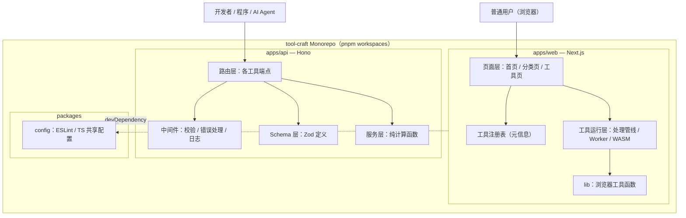
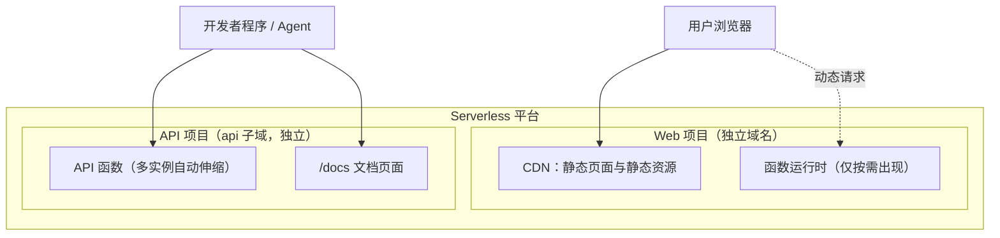
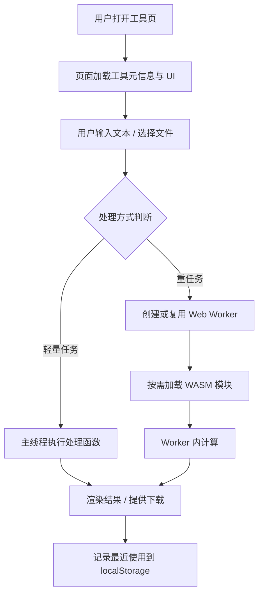
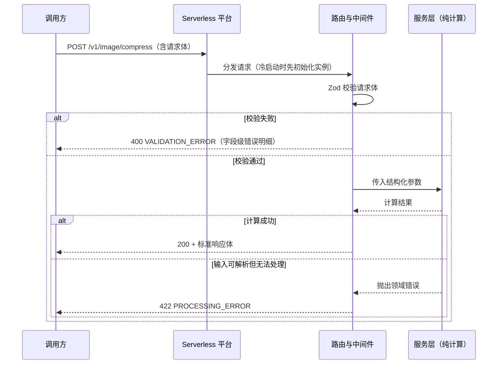

# Tool-Craft 技术方案文档

## 一、设计概述

### 1.1 设计范围

本方案覆盖 Tool-Craft 初期的工程全貌：Monorepo 仓库结构、Web Tools 静态站点的模块划分与 local-first 处理机制、API Tools 无状态函数的路由与校验机制、两个应用的部署拓扑，以及性能、安全、可用性方面的设计约定。

工程运行时基线为 Node.js ^24 与 pnpm ^11，全部技术选型的大版本锁定与兼容性核查见技术栈文档第四章。

以下内容明确不在本方案范围内：统一能力运行时、Web 与 API 的强制底层复用、账号体系、工具编排工作流、MCP/Agent 集成。这些是 PRD 列明的非目标，架构中不预留对应抽象层。`[Data-backed]`

### 1.2 需求追溯

设计中的每个主要部分都对应 PRD 的具体要求：

| PRD 要求 | 对应设计 |
|----------|----------|
| 两条产品线独立，不共享运行时 | 二、系统架构：apps/web 与 apps/api 独立构建、独立部署 |
| 以尽可能低的成本持续增加工具 | 三、应用与模块设计：工具注册表 + 文件式路由，新增工具只需新增一个目录 |
| Web Tools 优先本地处理 | 四、核心流程：浏览器内处理管线，默认不发起服务端请求 |
| 无强制登录 | Web 不接账号体系；localStorage 仅记录最近使用 |
| API 输入输出明确、文档清晰 | 五、接口设计：Zod 单一 Schema 来源，自动生成 OpenAPI 文档 |
| API 简单工具直接计算返回 | API 无状态、无数据库，单次请求内完成计算 |
| Monorepo 方便管理而非强制共享 | 三、packages 仅放 lint/tsconfig 等配置，不预设共享业务包 |
| 问题出现之后再抽象 | 八、演进规划：各抽象层只在触发条件满足后引入 |

### 1.3 术语

| 术语 | 含义 |
|------|------|
| 工具（Tool） | 一个独立的功能单元，对 Web 是一个页面，对 API 是一个或一组端点 |
| 工具注册表 | apps/web 中描述全部工具元信息的数据源，驱动首页、分类页与路由 |
| 处理管线 | Web 工具内部"读取输入 → 转换处理 → 产出结果"的固定执行路径 |
| 无状态函数 | 不在实例内保存跨请求数据的 API 函数，任意实例可处理任意请求 |

## 二、系统架构

### 2.1 架构风格

系统整体是"一个 Monorepo、两个独立应用"的结构，不采用微服务，也不采用单体服务。Web 侧是以静态产物为主的前端应用，API 侧是一组无状态 Serverless 函数，两者之间不存在调用依赖：Web 工具默认不调用本平台 API。保持这一距离是刻意的，它使两条产品线可以各自发布、各自选择实现方式，任何一侧的故障或重构都不波及另一侧。`[Expert judgment]`

### 2.2 逻辑架构



图中需要强调的一点是 WebApp 与 ApiApp 之间没有任何连线。packages 在初期只包含 config，UI 共享包与业务共享包留空，避免为尚不存在的重复需求付出抽象成本。`[Data-backed]`

### 2.3 部署架构



两个项目在平台上完全隔离：独立域名、独立环境变量、独立部署与回滚。浏览器首先命中 CDN 上的静态产物，这是 Web Tools 的主要访问路径；函数运行时处于备用位置，只在个别工具确有服务端需要时才启用。API 函数由平台按请求量自动伸缩，流量为零时段不产生计算费用。平台对 Node.js 24 运行时的支持情况、平台选型与冷启动表现需在首个版本上线前实测确认。`[To be confirmed]`

## 三、应用与模块设计

### 3.1 apps/web

| 模块 | 职责 | 边界（不做什么） |
|------|------|------------------|
| 工具注册表 | 以结构化数据维护每个工具的名称、描述、分类、路由、图标等元信息 | 不包含工具的处理逻辑 |
| 页面层 | 渲染首页、分类页、工具列表页与单个工具页 | 不承载数据处理 |
| 工具运行层 | 执行各工具的处理管线，按需创建 Worker、加载 WASM | 不向本平台服务端发送用户数据 |
| lib | 提供下载文件、读取剪贴板、localStorage 等浏览器通用函数 | 不放具体工具的算法 |

新增一个工具的标准动作是：在工具注册表增加一条元信息，在工具目录下实现一个页面，处理逻辑放在该工具自己的目录内。简单工具直接使用主线程 JavaScript；预计阻塞 UI 超过约 100ms 的处理放入 Web Worker，该阈值作为设计指导而非强制指标。`[Expert judgment]` 工具之间不互相依赖，不允许出现工具 A 导入工具 B 内部代码的情况；确需复用的函数先放入该工具目录，出现第三次重复时再上移到 lib。

### 3.2 apps/api

| 模块 | 职责 | 边界（不做什么） |
|------|------|------------------|
| 路由层 | 注册端点、绑定对应 Schema 与处理函数 | 不写计算逻辑 |
| 中间件 | 请求日志、校验失败与异常的统一错误转换、（未来的）鉴权 | 不感知具体工具的业务 |
| Schema 层 | 用 Zod 定义每个端点的请求与响应结构，并生成 OpenAPI 描述 | 不执行计算 |
| 服务层 | 纯函数形式的工具计算逻辑，输入确定则输出确定 | 不读取请求上下文、不产生副作用 |

依赖方向固定为路由 → 中间件 / Schema / 服务，服务层不反向依赖任何 Web 层对象，这保证计算函数可以脱离函数运行时直接用 Vitest 测试，也使未来迁移到 VPS 或其他运行时无需改动业务代码。`[Expert judgment]`

### 3.3 packages

初期只建立 config 包，导出共享的 TypeScript 编译选项、ESLint 与 Prettier 配置。PRD 示例中的 ui 包暂不创建：Web 的 shadcn/ui 组件位于 apps/web 内，API 没有 UI，建立共享 UI 包没有消费方。`[Data-backed]`

## 四、核心流程设计

### 4.1 Web 工具本地处理流程



整条路径中没有任何一步把用户输入发往服务器，这是 local-first 的具体落地方式，而不是一句口号。`[Data-backed]` Worker 采用懒加载：用户首次触发重任务时才加载对应脚本与 WASM 产物，工具页首屏不为此付出加载成本。处理失败（文件损坏、格式不符、内存不足）时，错误信息直接在页面的结果区域展示，用户可以调整输入后重试，页面状态不丢失。

### 4.2 API 请求处理时序



异常路径与正常路径同等重要：校验错误、领域错误、平台层错误必须返回不同的状态码与错误码，调用方才可能编写自动化重试或分支处理逻辑。冷启动耗时计入调用方的等待时间，因此框架与依赖保持精简，初始化阶段不建立连接池、不加载与本次请求无关的模块。

## 五、接口设计

### 5.1 接口概览

初期随具体工具逐个增加端点，不提前批量设计。以下两个端点构成首个可运行版本：

| 标识 | 方法与路径 | 用途 |
|------|-----------|------|
| API-001 | GET /v1/health | 存活检查，供平台与调用方探活 |
| API-002 | POST /v1/image/compress | 图片压缩，路径取自 PRD 示例 `[Data-backed]` |

### 5.2 接口契约

**API-001**

| 字段 | 内容 |
|------|------|
| 操作 | GET /v1/health |
| 参数 | 无 |
| 成功响应 | 200；`{ "status": "ok" }` |
| 错误码 | 无业务错误码 |
| 鉴权 | 无 |

**API-002**

| 字段 | 内容 |
|------|------|
| 操作 | POST /v1/image/compress |
| 用途 | 对上传的图片按目标质量与格式压缩，返回处理后的图片与元信息 |
| 请求 Content-Type | multipart/form-data |
| 请求参数 | image：文件，必填，类型限定为 image/jpeg、image/png、image/webp；quality：整数，选填，范围 1–100，缺省值 80；format：字符串，选填，枚举 jpeg/png/webp，缺省保持原格式 |
| 请求体大小上限 | 由部署平台配置确认 `[To be confirmed]` |
| 成功响应 | 200，multipart 场景下默认返回处理后图片二进制，Content-Type 与输出格式一致；响应头附带 X-Image-Width、X-Image-Height、X-Original-Size、X-Processed-Size |
| 错误响应 | JSON：`{ "error": { "code": "错误码", "message": "可读信息", "details": [] } }` |
| 鉴权 | 初期无；未来增加 API Key 时通过 Authorization 请求头传递 |
| 幂等性 | 相同输入参数产生相同输出，调用方可安全重试 |

Zod Schema 是该契约的唯一事实来源，本文表格、/docs 页面、路由代码三处必须一致；修改契约先改 Schema。请求体上限、函数执行时限的具体数值在平台配置阶段确认后回填本文。`[To be confirmed]`

### 5.3 错误码

| HTTP 状态码 | code | 触发条件 |
|-------------|------|----------|
| 400 | VALIDATION_ERROR | 请求参数缺失、类型不符、超出取值范围 |
| 401 | UNAUTHORIZED | （未来）缺少或传入无效 API Key |
| 404 | NOT_FOUND | 路径或请求的资源不存在 |
| 413 | PAYLOAD_TOO_LARGE | 请求体超过大小上限 |
| 422 | PROCESSING_ERROR | 输入格式正确但无法完成处理，如图片文件损坏 |
| 429 | RATE_LIMITED | （未来）触发限流 |
| 500 | INTERNAL_ERROR | 未预期的服务端异常，同时上报 Sentry |

错误响应结构全局统一，新增工具可以新增 4xx 业务错误码，但不允许改变响应体外层结构。

### 5.4 版本管理

路径前缀 /v1 即版本号。同一大版本内不做破坏性变更：只新增可选参数、新增响应字段、新增端点。需要删除字段或改变语义时发布 /v2，旧版本与新版本并行运行，下线时间提前在文档与响应头（Deprecation / Sunset）中公告，公告周期至少一个月。`[Expert judgment]`

## 六、数据设计

系统初期没有数据库，需要设计的数据只有两类：工具元信息与浏览器本地数据。

### 6.1 工具元信息

工具注册表是 Web 全站除页面外唯一的结构化数据源，单条记录的结构如下：

```typescript
interface ToolMeta {
  slug: string
  name: string
  description: string
  category: 'image' | 'text' | 'developer' | 'design' | 'file' | 'data' | 'other'
  path: string
  icon?: string
  tags?: string[]
  processing: 'mainthread' | 'worker' | 'wasm'
}
```

slug 全局唯一，作为工具的稳定标识，也是静态生成工具页的键。分类枚举对应 PRD 的初始分类，分类需要增减时直接修改枚举并重新构建，不为此引入可配置后台。`[Data-backed]` 首页、分类页、工具列表页均在构建期由这份注册表生成，运行时不查询任何数据源。

### 6.2 浏览器本地数据

| 键 | 内容 | 用途 |
|----|------|------|
| tool-craft:recent | 最近使用的工具 slug 列表（有上限，建议 10 条以内） | 首页展示最近使用 |

不记录用户输入、处理结果或任何可识别个人身份的信息。用户清除浏览器数据即完全删除，平台侧无副本。API 侧不保存任何跨请求数据。

### 6.3 引入持久化的边界

当 API Key 管理或用量计量成为真实需求时，优先使用部署平台的托管 KV/数据库服务，数据实体（Key、归属、配额、用量计数）在那时的增量设计中定义，本方案不提前设计表结构。

## 七、非功能性设计

### 7.1 性能

Web 侧以静态分发为性能基础：首页与工具页的 HTML、JS、WASM 产物由 CDN 边缘节点提供；各工具的重依赖按路由与实际操作分包懒加载，首屏不加载未使用工具的任何代码。交互反馈在 100ms 内给出，耗时处理通过 Worker 保证主线程不卡顿——这两个数值是设计目标，上线后用真实设备测量校准。`[Expert judgment]`

API 侧的延迟主要由冷启动与计算本身构成：框架保持精简、无初始化连接，热请求的框架开销控制在毫秒级；单次处理时长超过平台函数时限的工具不纳入无状态同步接口，先改为异步模式再提供。`[Expert judgment]` 平台函数时限的具体值需在部署配置时确认。`[To be confirmed]` 函数运行时与本地保持同一 Node.js 大版本（^24），避免版本差异导致的行为不一致。

### 7.2 安全

- Web 工具在浏览器本地完成处理，用户文件默认不离开设备，这是最重要的数据安全设计。`[Data-backed]`
- API 对所有输入做 Schema 校验与类型限定，并设置请求体大小上限，防止畸形输入与超大文件耗尽函数资源。
- 错误响应不返回堆栈、环境变量或内部路径；详细错误仅进入服务端日志与 Sentry。
- 密钥只存放于平台与 CI 的加密环境变量，仓库与前端产物中不出现任何密钥。
- 依赖保持精简并启用 CI 的依赖审计（pnpm audit），新增第三方库需确认其维护状态与产物体积。

### 7.3 可用性

两个应用均依托 Serverless 平台的多实例与多区域能力获得基础可用性，不自建容灾。API 无状态意味着任意实例可处理任意请求，平台可直接替换异常实例。部署采用不可变产物发布，每次发布保留历史版本，出现问题一键回滚到上一版本。GET /v1/health 供平台健康检查使用。

### 7.4 可观测性

- 日志：API 中间件为每个请求输出一行结构化 JSON，包含请求 ID、路径、状态码、耗时，不记录请求体内容。
- 异常：两个应用接入 Sentry，未捕获异常与错误码为 INTERNAL_ERROR 的请求自动上报。
- 指标：以平台自带的调用量、错误率、执行时长面板为准，不另建监控系统。
- Web 统计：使用隐私友好型统计，仅看页面访问量与工具使用量，不追踪单个用户。

## 八、演进规划

架构按 PRD 的渐进式策略分阶段推进，每个阶段只建立该阶段需要的结构，后一阶段的触发由真实问题驱动，而非时间表。`[Data-backed]`

| 阶段 | 建立的结构 | 进入下一阶段的触发条件 |
|------|-----------|----------------------|
| 阶段 1：首个版本 | Monorepo 骨架、apps/web、apps/api、packages/config；若干简单工具上线 | 工具数量增加，发现重复实现 |
| 阶段 2：按需提取 | 将重复三次以上的纯逻辑提取为 packages 共享包；重复 UI 提取为 packages/ui | API 出现滥用或计费需求 |
| 阶段 3：平台能力补齐 | API Key、限流、用量计量（托管 KV/数据库）；站内搜索索引 | 出现新的程序化消费需求 |
| 阶段 4：消费方式扩展 | 评估 MCP、Agent 集成、异步批量处理，作为独立入口接入 | 按真实需求逐项评估 |

阶段 1 不预留阶段 3、4 的任何接口或目录。当某个未来场景需要改动现有结构时，以当时的真实数据重新评估，而不是让初期架构迁就推测。
